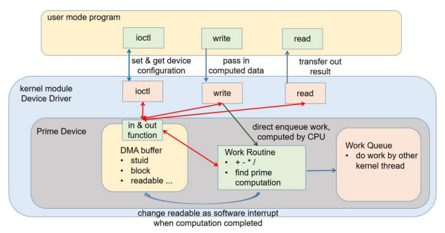

# primeDev
A virtual device that can find the n-th prime number or perform the basic 4 arithemtic operations

The project involves creating a device file and mapping driver functions to that file.
The device have blocking/non-blocking IO features controlled by the ioctl function.
It simulate registers on the device by allocating a DMA buffer.
The device driver will also count the number of interrupts of an input device (like a keyboard)

## The design of the Program


The program was designed according to the image.
The driver communicates to the user via the read and write functions as well as the ioctl function.
The ioctl function sets flags available in the DMA memory (acting as registers) and this will change the way the device may function (such as blocking/non-blocking IO). 

The driver will defer the arithmetic calculations to a seperate kernel thread via a workqueue.

The data is passed to the driver as a struct that contains the operands and the operator
```
struct DataIn {
    char a;
    int b;
    short c;
}
```
where `char a` is the operator.

## Running options and parameters
The ioctl functions are as given:
- HW5_IOCSETSTUID: prints the student_id to the kernel logs
- HW5_IOCSETRWOK: prints the status of the read and write functions to the kernel logs
- HW5_IOCSETIOCOK: prints the status of the ioctl function to the kernel logs
- HW5_IOCSERIRQOK: prints the status of the IRQ function to the kernel logs
- HW5_IOCSETBLOCK: sets the IO mode to blocking or non-blocking (initialized as non-blocking)
- HW5_IOCWAITREADABLE: Synchronizing function for non-blocking IO mode

Sample usage:
```
if (ioctl(fd, HW5_IOCSETBLOCK, &ret) < 0 ) {
    ...
}
```
The arithmetic operations available are the four basic arithmetic operations and finding the n-th prime number.

Sample usage:
```
write(fd, &data, sizeof(data));
read(fd, &return_val, sizeof(int));
```
> **_NOTE:_** data refers to a variable of the previously mention DataIn struct. Populate the data members before writing to the device driver

There is a sample test file (that is used for testing) to outline the usage better, please refer to it if you require an example.

## How to build and run
There is a given makefile and shell scripts to perform the necessary actions to use the device. First, simply call `make` to build and install the device driver, then check the `MAJOR` and `MINOR` numbers the driver is installed with via `dmesg`. Afterwards, install the virtual device with the `MAJOR` and `MINOR` numbers as arguments and run your test program.

1. `make`
2. `dmesg`
3. `sudo sh mkdev.sh MAJOR MINOR`
4. `./testfiles/test`

To safely remove the driver, simply call `make clean` as this will remove the installed device driver and clean the built files. Afterwards, remove the virtual device.

1. `make clean`
2. `sudo sh rmdev.sh`

## OS and Kernel version
This project was built, developed, and tested on:
```
Ubuntu Server 22.04.22 LTS
Linux Kernel ver. 6.4.1
```
